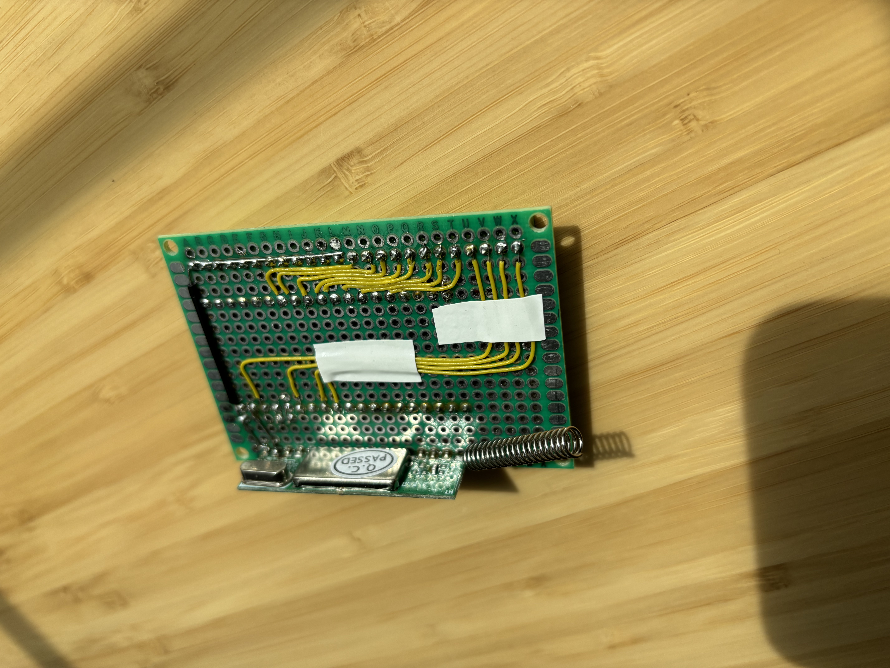
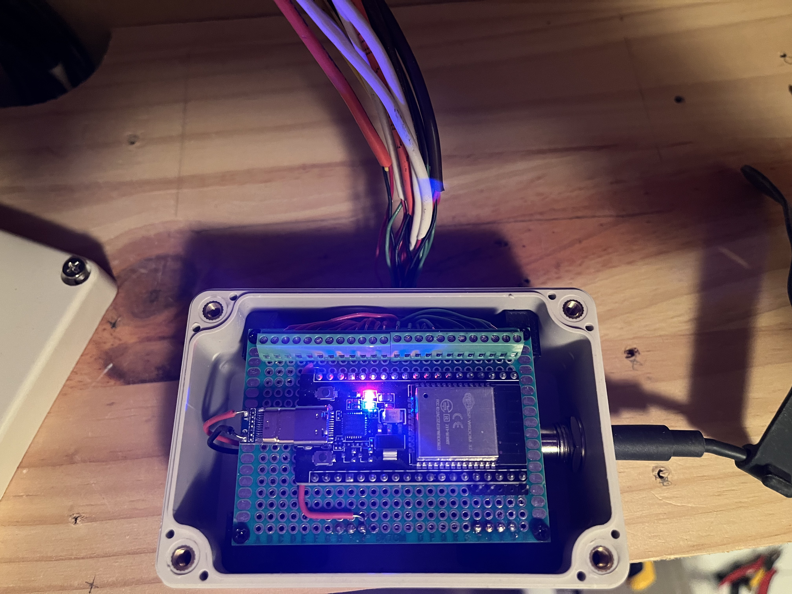
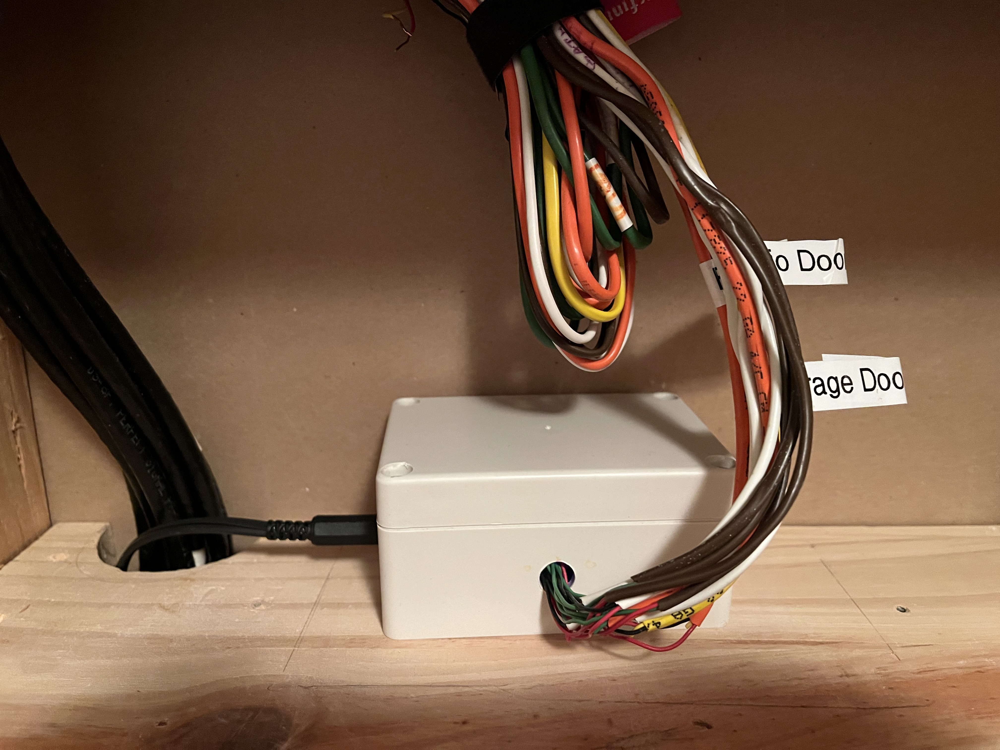

# Contact Sensors and Temperature and Humidity Sensor

## Intro
My house has an old home security system installed when it was built in 2004. It was powered by a DSC PC1555MX unit. After the battery died, it was just collecting dust. Recently I decided to hook up the contact sensors installed on the doors and windows. So later on, I can do some automation based on this information. E.g. if a window or door is open for too long in the winter, I want to be alerted so that I can save on the heating bills.

Most of my personal computing is done on Apple's ecosystem. So, I'd like to integrate it with HomeKit. Originally, I prototyped with a Raspberry Pi, running HomeBridge and [homebridge-rpi plugin](https://github.com/ebaauw/homebridge-rpi). It worked great. But I later ran into [HomeSpan Library](https://github.com/HomeSpan/HomeSpan/) for ESP32 that implements HAP, the protocol that talks to Apple HomeKit. So, I thought it was silly to run a full blown Linux for something this trivial. I beliee Espressif has also introduced an SDK based on ESP-IDF. But Arduino framework is easy to use for a simple project like this.

While I was working on this project, I decided to add a component to monitor the temperature and humidity of the bathroom so that I can automate the fan. These two components are completely independent of each other but it's convenient to combine them due to the physical location.

## Hardware setup

### Contact sensors
All the preinstalled contact sensors are simple [reed switches](https://en.wikipedia.org/wiki/Reed_switch). All the wires run inside walls and go to a centralized place in a walk-in closet. Each sensor has two wires. When the door or window is closed, the wires are connected, otherwise they are disconnected.

So the idea is to connect one wire to a pullup input pin and the other to the ground. So when the door or window is closed, the pin is grounded. Otherwise it's pulled high.

### Wireless temperature and humidity sensor
I purchased an Acurite 592TXR temperature and humidity sensor which is supposed to work with a base station. But I am using an RF receiver to read its signals with the microcontroller. The waveform and data protocol have been reverse engineered. I am writing up the details in a [separate doc](Acurite.md).

### RF receiver
The temperature and humidity sensor I use sends signals on [433 MHz](https://en.wikipedia.org/wiki/LPD433), which is the frequency used by many low powder devices in the US. There are many cheap 433 MHz receivers on AliExpress and Amazon. I experimented with three and two of them are worthless. Either they are very noisy or the range is just a couple of feet. The one I settled with is RXB6. It workds OK within 10 meters with a small, coiled antenna. The reception would grealy improve if I used a 1/4-lambda (17cm) antenna. But I wanted to keep the whole project small to fit in a compact enclosure.

### Microcontroller
I am using an ESP WROOM-32 dev board for this task. The follow is the pinout of the board.

What's slighly annoying about ESP32 is that certain pins have some restrictions. I found a good summary of such restrictions [here](https://randomnerdtutorials.com/esp32-pinout-reference-gpios/). I need 11 pins with internal pull-up resistors and 1 input pin without a pull-up resistor for the RF receiver. So there are enough to go around. I could use external pull-up resistors but would avoid if there're internal ones.

### Power Supply
I'm powering this unit with a home made 12 volt DC UPS. I have a bunch of adjustable LM2596 DC-DC converters around so I decided to use one of them.

### Misc
* Perfboard.
* Project enclusure. 100x68x50. I 3d printed a framework to mount the power supply and the perfboard.
* Barrel connector (for power).
* Terminal posts (for connecting the wires of the contact sensors).

## Software

The code for the contact sensors is straight-forward and self explaining. I did encounter a small road bump though. See the next section. Decoding the temperature and humidity sensor is a little more work. I'll elaborate in a [separate doc](Acurite.md).

I enlisted HomeSpan as a submodule of this repo so that it's all self contained.

## Challenges

For a simple project like this, I surprisingly encountered a few challenges that made me scratch my head.

1. This is the first time I've played with WiFi on an ESP32. When I started, I could get it connect it to my home WiFi for the life of me. It'd be trying to connect forever (like, 20 minutes), usually without success. I posted on many forums and eventually, I figured out that it's the breadboard! It works fine as soon as I take it out of the breadboard. I suppose the PCB antenna is too weak and the metal in the breadboard completely messes up the WiFi signal even if I'm sitting not even 10 meters from the AP.

1. I first tried to power the board via its 3.3v pin to bypass the regulator on the dev board. Strangely, it'd crash, brown out and lose its non volatile storage all the time. Then I tried the 5v pin. It seemed to boot, but again, it was not able to connect to the WiFi (indicated by the HomeSpan status LED)! It connected just fine if I powered it through the USB port. Then I tried to debug the issue by connecting a USB-serial adapter to its rx/tx pin so that I can monitor the serial console. I didn't want to use a USB cable because I knew it'd make the problem go away. However, that also made the problem go away. The issue only happened when it was powered on the 5v pin, with no serial connection. Which means, I can't really debug. Eventually I just gave up and soldered the output of the lm2596 to a usb connector and insert it to the usb port on the dev board. It seemed to have solved the problem.
I am at complete loss on this one. I thought the USB port's Vcc was directly connected to the 5v pin and there should be no difference whatsoever. And why would the serial port connection to the computer change the WiFi connectivity? And why didn't powering via the 3.3v pin not work?! If anyone reading this has any clue, I'd love to hear!

1. A minor issue on the software side. The first accessory I'm adding doesn't provide any services and will be recognized as a bridge. Technically, you don't need a bridge. However, when I did that, only 10 of the 11 accessories were recognized by Home app. I asked on [HomeSpan repo](https://github.com/HomeSpan/HomeSpan/discussions/813) and the author didn't know either. So this is an easy workaround.

## Gallery

The finished perfboard. The termianl posts are for connecting the wires. I soldered 3 pin heads (Rx, Tx, and GND) for connecting to a serial monitor for debugging. I'm using think 30 AWG wires for everything logic level and 24 AWG for power.

The final product. The project enclosure was purchased on AliExpress. I drilled holes for the barrel connector and the wires. A 3d printed framework supports the perfboard and the power supply.

