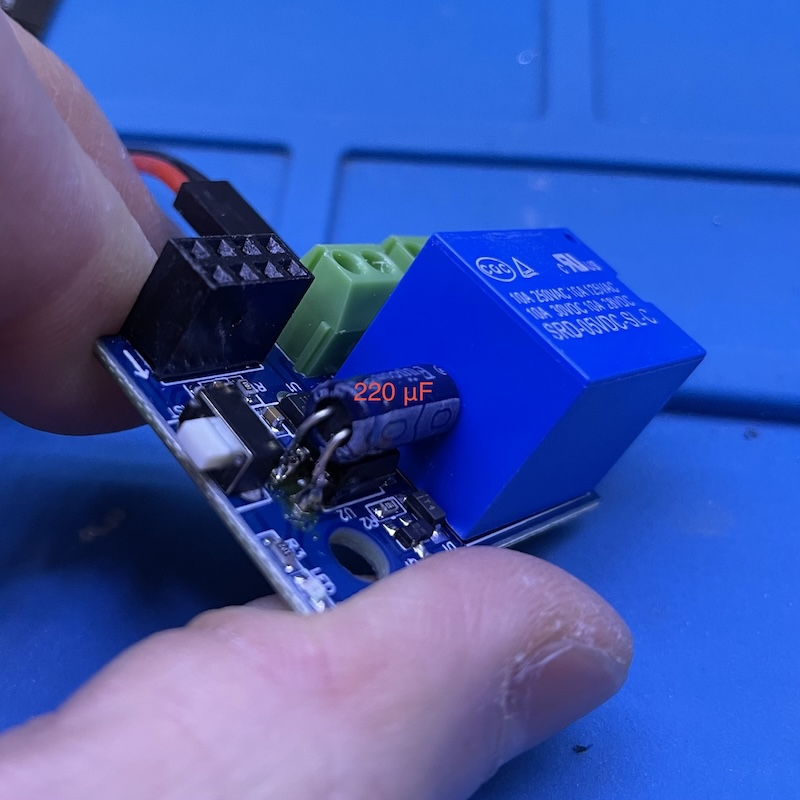

# ESP8266-01S based smart relay

I came across a bunch of neatly packed ESP8266 + relay boards on [Amazon](https://www.amazon.com/AOICRIE-ESP8266-Wireless-Transceiver-Compatible/dp/B09XHJFBSH) and AliExpress. Out of curiosity, I purchased one and made a HomeKit switch out of it.

# Software
There's an [Arduino library](https://github.com/Mixiaoxiao/Arduino-HomeKit-ESP32?tab=readme-ov-file) for HomeKit. It has what I need for the switch. But it's not nearly as nice as HomeSpan, the ESP32 library I've been using, for quite a few reasons. The following are two that immediately jumped out to me.

1. The WiFi settings are hard coded in the source code. I prefer not doing that so that I don't need to change the source code every time I check it into git. I also prefer not having to recompile and upload the sketch if the WiFi info changes. With HomeSpan, you specify WiFi info from the serial console.
2. There is no way to wipe the pairing info without uploading the sketch. If you remove the device from Home app, the device still thinks it's paired and would not enter pairing mode. Again, with HomeSpan, you can wipe out the data from the serial console.

If you just need a simple switch and don't need to make frequent changes, it'll probably work fine. Install the library in Arduino IDE, load example 2, and fill the WiFi info, and change switch pin to 0. That's about it. I'm also including the sketch in this repo.

# Hardware
It has 8 pins: Vcc, GND, Tx, Rx, En, GPIO0, and GPIO2. GPIO0 is used for controlling the relay. All the pins are marked on the PCB. To flash the ESP8266, I used an USB to serial adapter, with the following connection.

```
3.3V - Vcc
RX - TX
TX - RX
GND - GND
```

It doesn't have a BOOT0 button. So I had to short GPIO0 to GND with a tweezer while powering it on to enter the bootloader. 

The relay is active low on GPIO0, which causes a problem. When booting, the pin is somehow low until user code (or something else, I'm not sure) pulls it high. So, the relay briefly closes while booting. This is a potential issue for certain applications. And it looks like GPIO0 is actually *pulled* low while booting, not floating. So an external pull up resistor wouldn't work. I asked around and found a solution. It makes the switch slightly slower, but not noticeable to humans.

