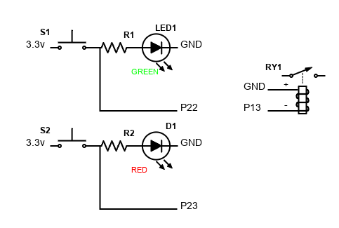

# Garage Door Opener with ESP32

## Mechanics and hardware

My garage door opener is extremely easy to control. The wall mount switch simply shorts two leads. When you press the button, if the motor is running (the door is being opened or closed), it stops the motor; otherwise, it starts the motor in the opposite direction. This is probably how most dumb garage openers work.

I am using an ESP32 MCU to control the garage door opener via a relay. The status of the garage door is detected by two reed switches, one placed at the open position and one placed at the closed position. A magnet is mounted on the shuttle of the opener and the switches are mounted on the track.

In addition, I am using two LEDs, one green and one red to physically indicate the position of the door.

* Microcontroller  
WiFi ESP WROOM-32  
Pinout:  

* Relay  
I am using a [2 Channel DC 5V Relay Module](
https://www.amazon.com/gp/product/B00E0NTPP4). But any 5V DC relay with one normally open channel will do.

* Sensors  
I am using two [reed switches](https://www.amazon.com/gp/product/B0735BP1K4/). But any normally open switches will do.

* LEDs and resistors  
These are completely optional. But I wanted to have some visual indicators for easy troubleshooting. I am using two 47 Ohm current limiting resistors, based on the assumption that the LEDs operate at 10-30 mA and have a voltage drop of ~2V.

## Sofwtare

I am running Homebridge on a Linux machine to integrate with HomeKit.

### Development settings  
* Arduino IDE, board: uPesy ESP32 Wroom DevKit.
* WiFi Library
* HTTP Server Library

### Design

There are two relatively independent components:
* State determination (detecting the current state of the door)
* Operation (opening and closing the door)

Since the door can be manually closed and opened, we should not use the operations to change the state. Rather, the state should be purely determined by the sensors. Let's call the upper sensor U and the lower sensor L. U is high if the door is closed. L is high if the door is closed.

We have the following 5 defined states:

* Open: U=1, L=0
* Closed: U=0, L=1
* Opening: U=0, L=0, previous state=closed
* Closing: U=0, L=0, previous state=open
* Stopped: U=0, L=0, previous state \in {opening, closing} and a certain period of time has passed since the last state transition (i.e. a timeout has happened)

When the program starts, we check if the state is open or closed. If both U and L are 0, we assume state = stopped, until an event changes it to another state.

The way my garage door operates, while the door is being opened or closed, two things can happen.

* A human presses the wall mount button or a remote and stops the door. 
* The door hits an obstacle and reverses its direction.

Therefore, we need to set a timeout after transitioning to opening or closing states. After the timeout, we should transition to unknown state.

We have 4 events driven by the sensors and timeout. 

* U 1->0 (UF)
* U 0->1 (UR)
* L 1->0 (LF)
* L 0->1 (LR)
* Timeout (TO)

LR: stopped -> closed, closing - > closed, opening -> closed, 

### Test cases
