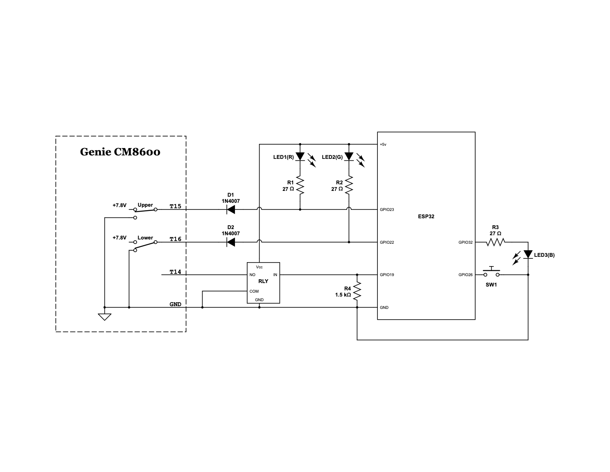

# Smartifying a Garage Door Opener with ESP32

## Objective

My house has a dumb garage door opener. And I wanted to integrate it with Apple's HomeKit so that I can monitor its status and operate it remotely. And I want to DIY. So here's the design of the control unit.

## Mechanics and hardware

My garage door opener Genie [CM8600](https://www.geniecompany.com/product-support/model-cm8600---legacy-screw-drive-series) is very rudimentary. The wall mount switch simply shorts two leads, one of which is the ground. When you press the button, the following logic applies:

* If the door is closed, it starts the motor to open it.
* If the door is open, it starts the motor to close it.
* If the motor is running (opening or closing), it stops the motor.
* If the motor is stopped but the door is half open, it starts the motor opposite of the direction it was previously running.

Also, when it's closing and it detects an obstruction, it reverses the direction of the motor and reverts to an open position. This is probably how most dumb garage openers work, or at least in a similar fasion. The remote works exactly as the button.

Two limit switches are installed on the track. One for the open position (upper) and one for the closed position (lower). When the carriage hits a limit switch, the opener stops the motor. The limit switches are normally open. One of the leads is the ground. The other one appears to carry a +7.8V DC voltage when open.

### Schematic


### List of components
* Microcontroller x 1
* 5V relay x 1
* 1N4007 diode x 2
* LED x 3 (red, green, and blue)
* 27Ω resistors x 3
* 1.5kΩ resistor x 1
* Pushbutton x 2
* Solderable breadboard x 1
* IPEX-1 to RP-SMA adapter x 1
* RP-SMA 2.4 GHz antenna x 1
* 5-pin M12 connector x 1 pair
* Wires
* Pin headers
* USB-C breakout board
* Project enclosure (115x90x50)

### Microcontroller
The brain of the project is an ESP32-WROOM-32UE MCU. I am using this MCU for the following reasons:

* It has built-in WiFi capability.
* It comes with an external antenna connector.
* There is a HAP library in Arduino framework.
* It's cheap.

Pinout:  


### Relay  
To operate the door, I simply use a relay to simulate a button press. The relay is controled with a GPIO pin. I am using this [5v Relay Module](https://www.amazon.com/dp/B00VRUAHLE). But any 5V DC relay with one normally open channel will do. I am using a 1.5K resistor to pull down the input of the relay to prevent accidental triggering while the microcontroller is booting, before I have a chance to write it LOW.

### Sensors  
For detecting the state of the door, I am piggybacking on the existing limit switches, instead of using my own sensors. The MCU and the opener share the ground. The GPIO pin is connected to the non-ground wire of the limit switch via a diode. When the siwtch is open, the diode prevents the 7.8v from backflowing to the GPIO. Essentially, the pin is free floating. So, it should be configured as a pullup input pin. When the switch closes, the GPIO is shorted to the ground. In practice, I found that there is a ~0.7v voltage drop on the diodes I'm using (1N4007, which is technically a rectifying diode, but I happened to have a whole lot). But that's low enough that the GPIO would still read low.

Ideally, one would want to complately separate the two units. But I'm not too worried since an ESP32 is extremely cheap. And I don't want to deal with the hassle of installing two extra mechanical or [reed switches](https://www.amazon.com/gp/product/B0735BP1K4/) and running the wires.

### Indicators
To make it easy to visualize the status of the switches, I am using two LEDs, one red and one green, tied to the limit switches. When a switch is closed, the corresponding LED lights up. The anode is connected to +5v and the cathode is connected to the GPIO pin. I'm using the +5v instead of the +3.3v due to that 0.7v drop on the 1N4007, which would reduce 3.3 to ~2.6, a bit low for the LEDs I have on hand. One caveat here is that the +5v is not regulated on the board. So there's a risk of frying the LEDs if that voltage goes too high, since my current limiting resistors are very small.

Also, interestingly, in practice, I am only getting ~4.6v from the +5v pin when powered through the USB port. I thought it was directed connected to the Vcc of the USB port? Oh well. The remaining 3.9v (4.6 minus the drop on the diode) is good enough for the LEDs, whose voltage drop is ~3v and I'm using very small current limiting resistors (27 Ω) here.

### Misc
- Status LED. Optionally, HomeSpan uses an LED to indicate its status. I am using a blue one for this purpose.
- Control button. You can also interact with HomeSpan with a pushbutton.
- Pinheaders. I soldered pinheaders to the Rx, Tx, Vcc, and ground pins of the ESP32 so that I can connect it to a serial monitor for debugging if needed. It's easier than connecting to the micro USB port once the board is inside the enclosure.
- Antenna & U/FL to PR-SMA adapter. Since this device is running in the garage, where the WiFi reception isn't the strongest, I am using a board with an external antenna connector. 
- USB C breakout board. My ESP32 dev board comes with a micro USB port and I want to power it with a USB C plug. What's more, I don't want the layout to be constrained by the position of the USB port. Therefore I'm using a USB breakout board to interface with the outside. 
- M12 connectors. Other than power, the unit has 4 wires connecting to the garage door opener: ground, relay, and 2 limit switches. To make things tight and neat, I'm using a pair of M21 connectors.
- PCB. I am not well versed in designing PCB boards. And it's too much hassle to manufacture just one board. So I'm using a [solderable breadboard](https://www.amazon.com/EPLZON-Solderable-Breadboard-Gold-Plated-Electronics/dp/B0BP28GYTV) like this:  


## Software
I'm using Arduino framework and [HomeSpan Library](https://github.com/HomeSpan/HomeSpan) for this project. I chose Arduino over ESP-IDF because of the simplicity.

### Design
There are two relatively independent components:
* State determination (detecting the current state of the door)
* Operations (opening and closing the door), coming from the HomeKit

Since the door can be manually closed and opened, we should not use the operations to change the state. Rather, the state should be purely determined by the sensors. Let's call the upper sensor U and the lower sensor L. U is low if the door is closed. L is low if the door is closed.

We have the following 5 defined states, which are all recognized in [HAP](https://hexdocs.pm/hap/HAP.Characteristics.CurrentDoorState.html).

* OPEN: U=0, L=1
* CLOSED: U=1, L=0
* OPENING: U=1, L=1, previous state=CLOSED
* CLOSING: U=1, L=1, previous state=OPEN
* STOPPED: U=1, L=1, previous state \in {OPENING, CLOSING} and a certain period of time has passed since the last state transition (i.e. a timeout has happened)

When the program starts, we check if the state is OPEN or CLOSED. If both U and L are 1, we assume state = STOPPED, until an event changes it to another state.

The way my garage door operates, while the door is being opened or closed, two things can happen.

* A human presses the wall mount switch or a remote and stops the door. 
* The door hits an obstacle and reverses its direction (only applicable to closing).

Therefore, we need to set a timeout after transitioning to OPENING or CLOSING states. After the timeout, we should transition to STOPPED state. Every time we transition to OPENING or CLOSING state, we start a timer. When the timer runs out, a timeout event is triggered. When we transition to OPEN, CLOSED, or STOPPED state, the timer stops.

When we consider the operation requests from HomeKit, there is also another type of timeout. After the operation is requested, if we don't hear from either sensor in a bit, either the motor has failed or the relay didn't work. To distinguish them, we call this kind "start timeout", since we are waiting for the operation to start. The previous kind is referred to as "finish timeout", since we are waiting for the foor to reach a stable state.

A start timeout doesn't change the state of the statemachine, since literally no physical state has changed. But we need to take care to cancel any pending operation and reset the target state to get HomeKit to a stable state.

So, in summary, as far as the statemachine goes, there have 4 events driven by the sensors and (finish) timeout.

* Upper sensor 1->0 (UF)
* Upper sensor 0->1 (UR)
* Lower sensor 1->0 (LF)
* Lower sensor 0->1 (LR)
* Finish timeout (FTO)

Instead of drawing a state machine, I'm just listing all the transitions in the following table.

```
        |   UR   |   UF   |   LR   |   LF   |  FTO   | 
--------+--------+--------+--------+--------+--------+
OPEN    |closing |        |        |        |        |
CLOSED  |        |        |OPENING |        |        |
OPENING |        |  OPEN  |        | CLOSED |STOPPED |
CLOSING |        |  OPEN  |        | CLOSED |STOPPED |
STOPPED |        |  OPEN  |        | CLOSED |        |
--------+--------+--------+--------+--------+--------+
```

All empty cells should be invalid transitions, as far as our unit is concerned. Some are due to lack of information. E.g. the door could transition from STOPPED to both OPENING or CLOSING. But since such events don't go through our unit, we have no way to detect. So we stay in STOPPED until the opening or closing finishes and triggers a transition to OPEN or CLOSED.

### Prototyping and debugging
I use a dev board with a PCB antenna for prototyping. Interestingly, when inserted into a breadboard, it does not connect to the WiFi, probably due to shielding of the metal in the breadboard. This made prototyping difficult because I can't use the breadboard. So, here's the prototype I built:


The two rocker switches simulate the limit switches. The two pushbuttons were harvested from old mice. Their pins are 5mm pitch.

To debug the final product where the USB port on the ESP is hard to reach, I use a USB to UART CP2102 adapter. Connect 5v, GND, Rx and Tx pins. To upload a sketch, you need to press and bold boot, then press and release reset. After uploading the sketch, you'll need to manually reset.

However, I enabled OTA in the sketch, so that I can update the firmware over WiFi. So, hopefully I won't need to physically access the project in the future.

## Test cases
To minimize trouble shooting in production, I use switches to simulate the sensors and fully test all these scenarios before hooking up with the actual opener.

### Open manually
1. Start from CLOSED.
1. Manually open lower sensor.
1. Manually close upper sensor.

* Expected: 
  - tile: closed -> opening -> open.

#### Open manually, close manually
1. Start from CLOSED.
1. Manually open lower sensor.
1. Manually close lower sensor.

* Expected: 
  - tile: closed -> opening -> closed.

#### Open manually, timeout, open manually
1. Start from CLOSED.
1. Manually open lower sensor.
1. Wait for a timeout.
1. Manually close upper sensor.

* Expected: 
  - tile: closed -> opening -> open -> open.

#### Open manually, timeout, close manually
1. Start from CLOSED.
1. Manually open lower sensor.
2. Wait for a timeout.
1. Manually close lower sensor.

* Expected: 
  - tile: closed -> opening -> open -> closed.

#### Close manually
1. Start from OPEN.
1. Manually open upper sensor.
1. Manually close lower sensor.

* Expected:
  - tile: open -> closing -> closed.

#### Close manually, open manually
1. Start from OPEN.
1. Manually open upper sensor.
1. Manually close upper sensor.

* Expected: 
  - tile: open -> closing -> obstructed

1. Tap the tile to close.
1. Manually close lower sensor.

* Expected: 
  - relay: engaged and disengaged
  - tile: obstructed -> closing -> closed

#### Close manually, timeout, close manually
1. Start from OPEN.
1. Manually open upper sensor.
1. Wait for a timeout
1. Manually close lower sensor.

* Expected: 
  - tile: open -> closing -> open -> closed

#### Close manually, timeout, open manually
1. Start from OPEN.
1. Manually open upper sensor.
1. Wait for a timeout
1. Manually close upper sensor.

* Expected: 
  - tile: open -> closing -> open -> open  


#### Close in app with obstruction
1. Start from OPEN.
1. Tap tile to close.
1. Manually open upper sensor.
1. Manually close upper sensor.

* Expected: 
  - relay: clicks
  - tile: open -> closing -> obstructed

1. Tap the tile to close.
1. Manually close lower sensor.

* Expected: 
  - relay: clicks
  - tile: obstructed -> closing -> closed

#### Open in app
1. Start from CLOSED.
1. Tap on the tile to open.
1. Manually open lower sensor.
1. Manually close upper sensor.

* Expected: 
  - relay: engaged and disengaged
  - tile: closed -> opening -> open

#### Open in app, close manually
1. Start from CLOSED.
1. Tap on the tile to open.
1. Manually open lower sensor.
1. Manually close lower sensor.

* Exptected:
  - relay: clicks
  - tile: closed -> opening -> closed

#### Open in app, timeout, open manually
1. Start from CLOSED.
1. Tap on the tile to open.
1. Manually open lower sensor.
1. Wait for a timeout.
1. Manually close upper sensor.

* Expected:
  - relay: engaged and disengaged
  - tile: closed -> opening -> open -> open

#### Open in app, timeout, close manually
1. Start from CLOSED.
1. Tap on the tile to open.
1. Manually open lower sensor.
1. Wait for a timeout.
1. Manually close lower sensor.

* Expected:
  - relay: clicks
  - tile: closed -> opening -> open -> closed

#### Close in app
1. Start from OPEN.
1. Tap on the tile to close.
1. Manually open upper sensor.
1. Manually close lower sensor.

* Expected:
  - relay: clicks
  - tile: open -> closing -> closed

#### Open in app from STOPPED, 1
1. Start from OPEN.
1. Tap on the tile to close.
1. Manually open upper sensor.
1. Wait for a timeout to reach STOPPED.
1. Tap on the tile to open.
1. Manually close upper sensor.

* Expected:
  - relay: clicks twice
  - tile: open -> closing -> open -> open

#### Open in app from STOPPED, 2
1. Start from OPEN.
1. Tap on the tile to close.
1. Manually open upper sensor.
1. Wait for a timeout to reach STOPPED.
1. Tap on the tile to open.
1. Manually close lower sensor.
1. Manually open lower sensor.
1. Manually close upper sensor.

* Expected:
  - relay: clicks 3 times (after two taps, and once after reaching CLOSED)
  - tile: open -> closing -> open -> closed -> opening -> open

#### Close in app from STOPPED, 1
1. Start from CLOSED.
1. Tap on the tile to open.
1. Manually open lower sensor.
1. Wait for a timeout to reach STOPPED.
1. Tap on the tile to close.
1. Manually close lower sensor.

* Expected:
  - relay: clicks twice
  - tile: closed -> opening -> open -> closed

#### Close in app from STOPPED, 2
1. Start from CLOSED.
1. Tap on the tile to open.
1. Manually open lower sensor.
1. Wait for a timeout to reach STOPPED.
1. Tap on the tile to close.
1. Manually close upper sensor.
1. Manually open upper sensor.
1. Manually close lower sensor.

* Expected:
  - relay: clicks 3 times (after two taps, and once after reaching OPEN)
  - tile: closed -> opening -> open -> open -> closing -> closed

#### Open in app from CLOSING
1. Start from CLOSED.
1. Manually open lower sensor.
1. Tap on the tile to close.
1. Manually close upper sensor.
1. Manually open upper sensor.
1. Manually close lower sensor.

* Expected:
  - relay: clicks twice, once after the tap, again after reaching OPEN
  - tile: closed -> opening -> closing -> closed

#### Close in app from OPENING
1. Start from OPEN.
1. Manually open upper sensor.
1. Tap the tile to open.
1. Manually close lower sensor.
1. Manually open lower sensor.
1. Manually close upper sensor.

* Expected:
  - relay: clicks twice, ince after the tap, again after reaching CLOSED
  - tile: open -> closing -> opening -> open

#### Open in app from CLOSED, motor failure
1. Start from CLOSED.
1. Tap the tile to open.
1. Wait for a start timeout.

* Expected:
  - relay: clicks
  - tile: closed -> opening -> closed

#### Open in app from STOPPED, motor failure
1. Start from OPEN.
1. Manually open upper sensor.
1. Wait for the timeout to reach STOPPED.
1. Tap the tile to open.
1. Wait for the start timeout.

* Expected:
  - relay: clicks
  - tile: open -> closing -> open

#### Close in app from OPEN, motor failure
1. Start from OPEN.
1. Tap the tile to close.
1. Wait for a start timeout.

* Expected:
  - relay: clicks
  - tile: open -> closing -> open

#### Close in app from STOPPED, motor failure
1. Start from CLOSED.
1. Manually open lower sensor.
1. Wait for the timeout to reach STOPPED.
1. Tap the tile to close.
1. Wait for the start timeout.

* Expected
  - relay: clicks
  - tile: closed -> opening -> open

## Logging
To help with diagnostics, I am logging messages to a remote server. The server is running on my home LAN on an Ubuntu machine. I am planning to use it for other projects as well. The service is very simple, it accepts requests over http post requests and writes the log entries to a text file. When the file gets too big, it's rolled over.

### Client
Posts over http with the following info in json format
1. channel name (containing only alphanumericals, `_`, `-`, and `.`)
1. message (string, properly escaped for json)

E.g. 

```
{"channel":"garage","message":"hello world"}
```

### Server
Saves entries in `/var/lib/httplog/$ip.$channel.log`, one line for each entry, with the the time stamp and the message, separated by a `,`. Note that I am not checking if the message itself contains a new line. If it does, it'll mess up with the format. But this is for my personal usage, not a library.

I am using [pm2](https://pm2.keymetrics.io/docs/usage/quick-start/) to run the service as a daemon upon booting.

- Install node.js, npm, and pm2:  
  ```
  sudo apt install nodejs
  sudo apt install npm
  sudo npm install pm2@latest -g
  ```
- Create a dedicated user:  
  ```sudo useradd httplog```
- Create a folder to store the logs:  
  ```
  sudo mkdir -p /var/lib/httplog
  sudo chown httplog /var/lib/httplog
  sudo chgrp httplog /var/lib/httplog
  ```
- Deploy the script to the server from a client (adjust permissions if needed):  
  ```scp httplog.js andromeda:/var/lib/httplog```
- Set up pm2 to run as part of startup script:  
  ```sudo env PATH=$PATH:/usr/bin /usr/local/lib/node_modules/pm2/bin/pm2 startup systemd -u httplog --hp /home/httplog/```
- Switch to the new user:  
  ```sudo -u httplog bash```
- Launch it with pm2:  
  ```pm2 start httplog.js```
- Save the list:  
  ```pm2 save```
- Reboot and make sure it's running:
  ```
  sudo -u httplog bash
  pm2 list
  ```
- From a client, use curl to test:
  ```
  curl -X POST -H "Content-Type: application/json" -d '{"channel":"garage","message":"hello httplog"}' http://server:3000/
  ```

## Final assembly and installation
Once the software has been throughly tested, it's time to solder all the components and mount everything in the enclosure. I 3d printed a framework to mount the PCB, the relay, the pushbutton, and the USB C breakout board inside the enclosure.

The MCU and the relay
* Enclosure
  - Control button
  - Status LED
  - Antenna connector (RP-SMA)
  - M12 connector (4 pins: GND, upper sensor, lower sensor, relay)
  - USB-C breakout board


To connect to the CM8600, I soldered two wires to limit switches on the sequencer assembly(part J on page 5 of the manual). The relay wires can be accessed on the terminal strip (part M). And the ground is the metal front plate (part B) and I just wrapped a wire around a screw (part 42).


And here is the final product:


## Build note
* I have enlisted HomeSpan as a submodule such that this repo is self contained.
* HomeSpan submodule is checked out at detatched head 1.9.0.
* ESP32 3.x has some breaking changes. HomeSpan doesn't build. I used 2.0.17.