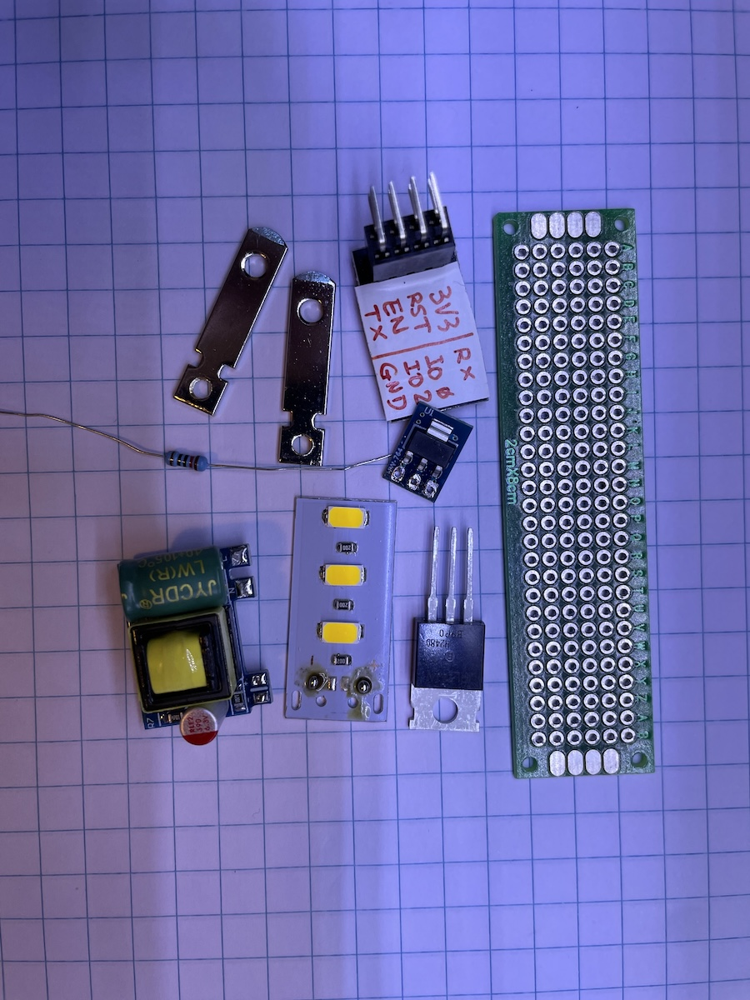

# Smart Night Light
In this project, I made a smart night light that plugs directly into an AC socket, using some inexpensive components I had laying around the house. It's powered by an ESP8266 microcontroller, which is not my first choice for a smart home project, but it's functional and it's cheap. The light source was removed from a USB LED light.

## Circuit
This is a simplest possible smart home project with the ESP8266. I just use one pin (GPIO 0 in my case) to switch a MOSFET which in turn switches an LED light. 

## Firmware
I'm using [this HomeKit library](https://github.com/Mixiaoxiao/Arduino-HomeKit-ESP8266) for ESP8266. I copied the switch example and made a couple of very minor changes.

## Part list
* AC to 5V DC [adapter module](https://www.amazon.com/dp/B093GW6SZ1). This is the main power source for the MCU and the light. Make sure the output is enough to power both. The ESP8266 draws ~250 mA when booting up or connecting to the WiFi. My light draws ~150 mA.
* 3.3V DC [regulator](https://www.amazon.com/dp/B01HXU1NQY). This is the power source for the MCU, not the light. Any 3.3v regulator will do. But make sure it can handle ~250 mA. ESP8266 is power hungry when trying to connect to the WiFi. Although the running current doesn't seem to exceed 100 mA.
* Regulator capacitor 10 μF x 2. I'm using a regulator breakout board with capacitors already soldered.
* ESP8266 ESP-01 [module](https://www.amazon.com/dp/B010N1ROQS). This little compact module has just enough pins for programming and control one or two accessories.
* MOSFET 1N7000. Any N channel MOSFET will do, as long as it can handle 5V and whatever current the light draws. I considered using a MOSFET with lower Rds(on) since I was seeing a ~1V drop between drain and source of the 1N7000, which is a little big. In end end I gave up on that idea since 1N7000 is so much more compact than the alternatives. I don't intend to keep this light on for long periods.
* Resistor 120 Ω. Value not critical. It connects the logical output of the microcontroller to the gate of the MOSFET.
* 5V LED light module. I have one that I bought from AliExpress long ago for a few dimes. It's 3 LEDs in parallel, each with a current limiting resistor. It came with a USB plug and a shell.
* Power plug blades. I sacraficed a [power plug](https://www.amazon.com/dp/B09XDXY1RC).
* Perf board, pin headers, wires, etc.

## Assembly
To put everything together:
* I 3d printed an enclosure, split into the [top](top.stl) and the [bottom](bottom.stl) halves, held together by friction and one screw.
* The blades are friction fitted to the enclosure then reenforced with a drop of hot glue. 
* The LED module is fitted and taped to the bottom half of the enclousure.
* The bottom of the enclosure has cutouts for the LEDs. 
* The low voltage components are soldered onto a perf board. A 2x4 pin header is also soldered for the MCU module. 

## Final product
I placed it near the entrance from garage. I added an automation to turn it on when the door is opened during the night and to turn it off automatically after one minute.

