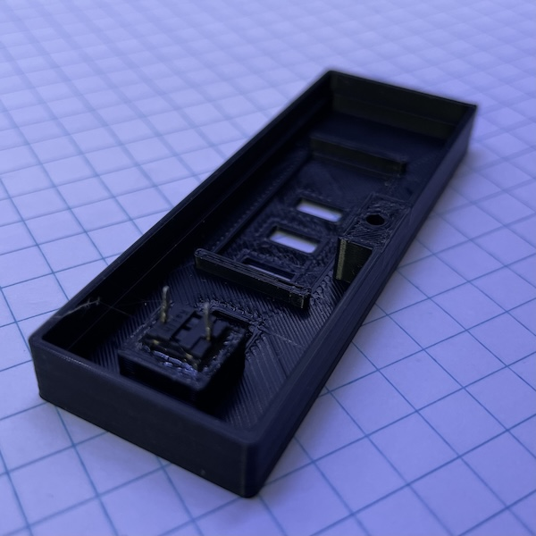

# Smart Night Light 2.0
This is an updated version of [Night Light 1.0](../night_light/README.md). Improvements:

* It uses an ESP32 C3 microcontroller and HomeSpan library.
* It has a micro button to manually switch the light.
* The overall height is slightly smaller.

## Part list

Everything except the power plugs can be sourced from AliExpress for much cheaper.

* 3d printed enclosure. STL for the [top](top.stl) and the [bottom](bottom.stl).
* 5V LED light assembly.
* MOSFET 2N7000. This MOSFET isn't ideal. Its Rds(on) is too high, causing a 1V voltage drop between drain and source. But it works and it's super compact.
* Optional resistor 150Ω. The value doesn't really matter much. Anything from 100Ω to 1kΩ will do.
* Micro [button](https://www.amazon.com/dp/B0D5X9FB9J). I have a few from old mice. 
* ESP32 [SuperMini](https://www.amazon.com/dp/B0D4QD19BB).
* Power plug [contacts](https://www.amazon.com/dp/B09XDXY1RC). I extracted the blades and tapped threads on them to screw wires on.
* 5V DC [adapter](https://www.amazon.com/dp/B093GW6SZ1).
* Perf board, wires, etc.

## Assembly

The button is glued to the bottom half of the case. 

The resistor, MOSFET, and wiring is soldered onto the perf board, which is then soldered on the switch. If I soldered the button to the perf board first, I wouldn't be able to apply glue to the button. There might be a better way to fasten the button.

Everything else is fastened with double sided tapes and hot glue.

