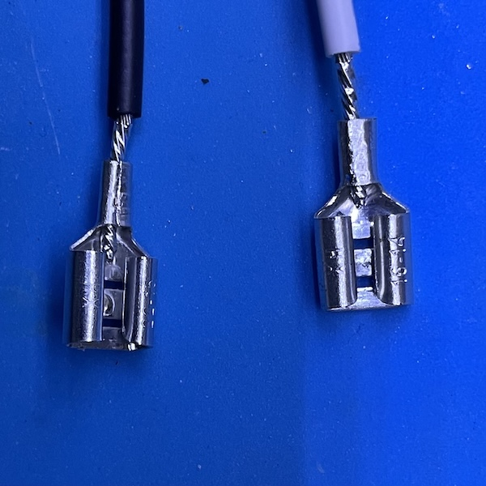
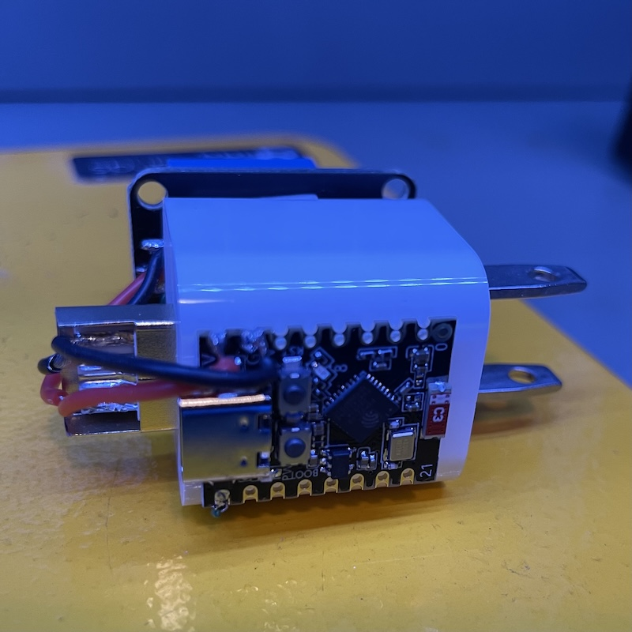
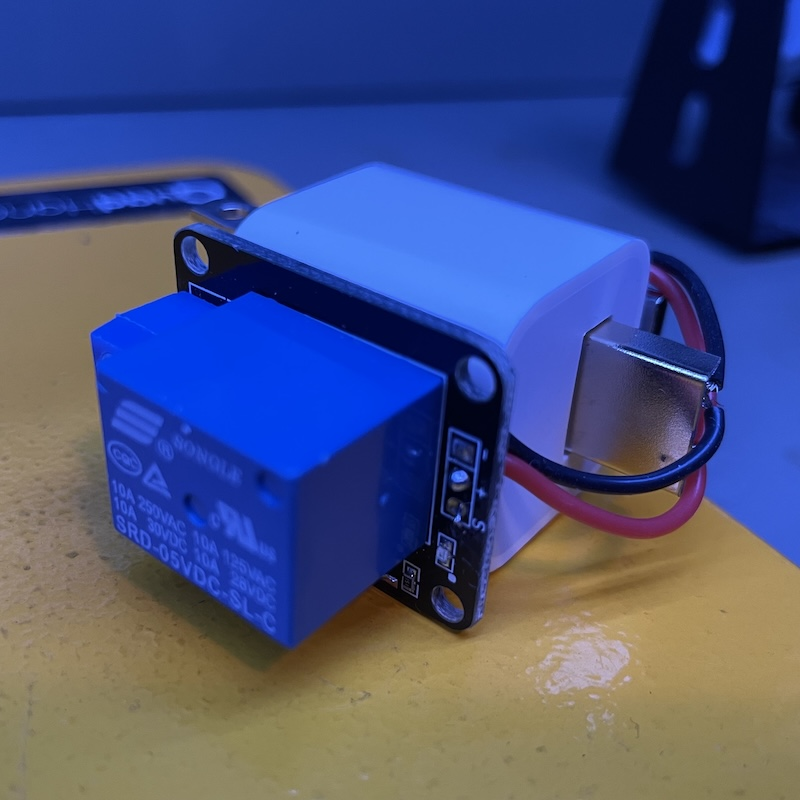
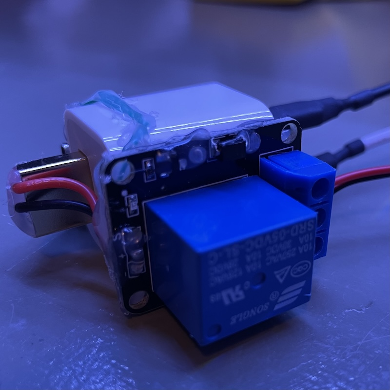
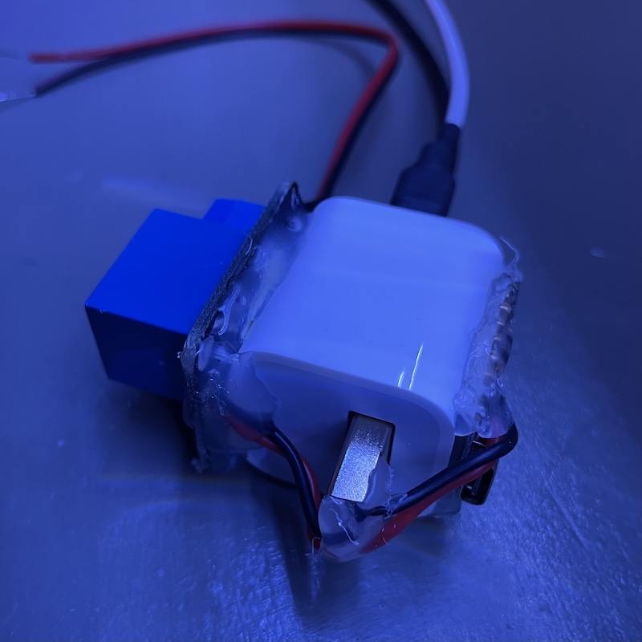

# Smart Switches for Thermocouple Fireplaces

My house has 2 gas fireplaces. They can only be turned on if:

* The pilot light is on.
* The wall switch is turned on.

I wanted to integrate them into the HomeKit ecosystem. Originally I thought they had a mechanism to open the gas valve using the mains. So I was going to install an off-the-shelf smart switch, which I happened to have one. However, when I tried to turn off the breaker to install it, it didn't turn off the fireplaces. So I opened up the wall switch and found that there are only two wires. A mains switch would have ground, neutral, live to both the source and the load. And I measured only less than half volt of DC across the wires. Some searching on Google told me that they are [thermocouples](https://en.wikipedia.org/wiki/Thermocouple).

So, instead of smart wall switches, I'd need smart relays. I also want the relays to work in parallel with the existing switches. I.e. either can turn on the fireplace but to turn it off, both the wall switch and the relay need to be turned off. This way, I can still manually turn on the fireplaces when there's a power outage. There are some off-the-shelf options, such as [this](https://www.amazon.com/Shelly-Bluetooth-Automation-Compatible-Required/dp/B0CQCDPLCF). But what's the fun in that?!

So I opened my drawer and did an inventory of the parts needed for the project. It looked like I had everything I needed, at least for prototyping.

* ESP32 microcontroller
* Logic level mechanical relay
* 5V DC adapter
* Misc wires and connectors

Since I've already done a couple of projects with HomeSpan, this would be very trivial in terms of coding. I just need a generic switch, and I'd use a pin to control the mechanical relay. 10 minutes later, I had the code up and running on an ESP32-WROOM-32UE dev board.

Now, the challenges are:

1. Power the unit. Fortunately, there is a mains switch right next to the fireplace switch. So I can use a USB charger to provide 5V DC to both the microcontroller and the mechanical relay.
2. Put everything inside the electrical box, behind the wall switch. So it needs to be very compact.

I have a whole drawer of USB chargers. It looks like iPhone charger is the most compact one. I also happen to have an [ESP32-C3 SuperMini](https://www.amazon.com/ESP32-C3-Development-Bluetooth-Single-Core-Processor/dp/B0D4QK5V74), which is the size of a stamp. The mechanical relay I have in hand is about the same size as the charger. As long as I connect mains directly to the charger without a socket, everything should be pretty neat and compact. Sweet!

So, here's the plan:

* Use a couple of blade connectors to connect the USB charger to mains. After crimping, I also put a little solder to secure the connection. Once they are inserted onto the charger, use heat shrink to cover the bare metal.

* Hot glue the dev board and the relay to the charger.

* Solder wires to USB A connector for power. You can find such connectors on AliExpress.

* Generously apply hot glue to cover all exposed metal.

Installation is rather straight-forward. The biggest challenge is finding the breaker!

Viola! An hour and half later, I have myself a HomeKit switch for controlling a fireplace! Now I just need to make another one but I can't seem to find another relay in my drawers.

A couple of notes regarding the sketch:

* The dev board I have in hand has 4MB flash memory. The default partition scheme only allocates 1.2MB to the app and that's not big enough for HomeSpan. In Arduino Studio, I was able to choose a scheme with 3MB for the app with no OTA (flashing over WiFi). I'm sure you can make a custom partition to accomodate OTA but I didn't bother. OTA is nice but I doubt I'd need to flash it once it's up and running. And it's not that big of a deal if I need to open up the wall and flash it.

* In Arduino Studio, choose "Nologo ESP32C3 SuperMini" as the board. 